##### 创建新的虚拟机

###### 1. 点击创建新的虚拟机

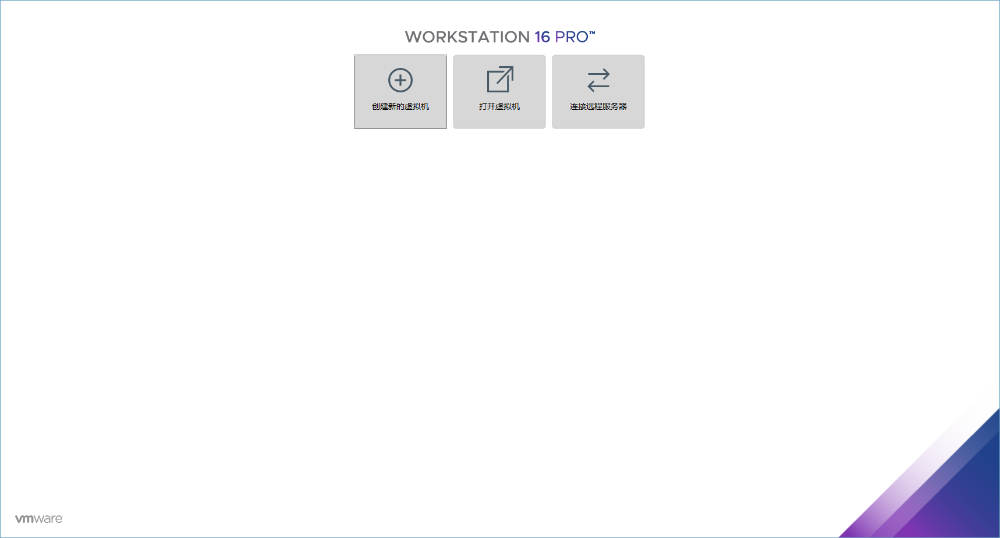

###### 2. 选择自定义高级

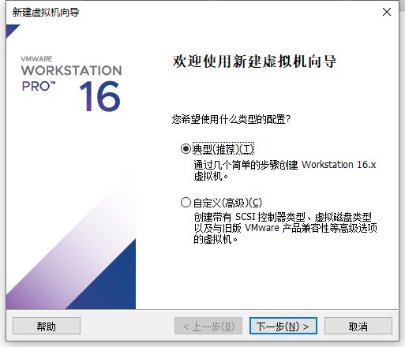

###### 3. 选择虚拟机的硬件兼容，为默认即可

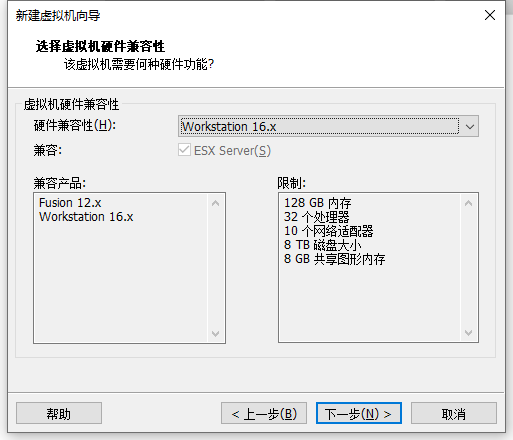

###### 4. 选择对应镜像的光驱

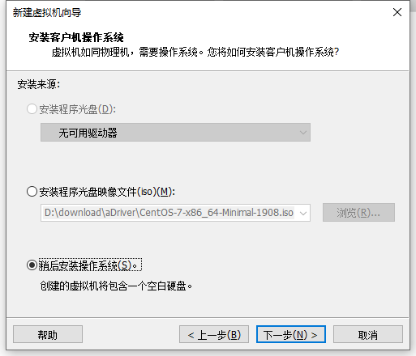

###### 5. 给虚拟机命名以及放置到磁盘的位置

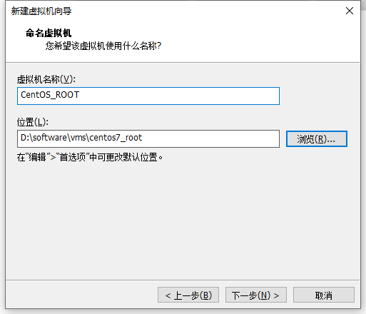

###### 6.  为虚拟机指定处理器数量

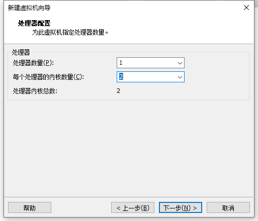

###### 7. 指定虚拟机的内存

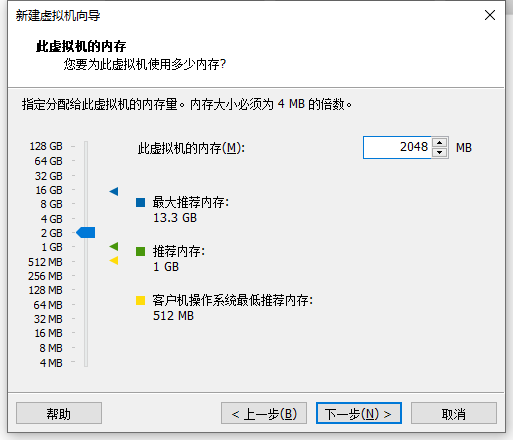

###### 8. 选择网络连接类型

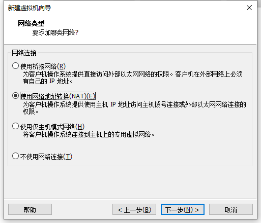

###### 9. 选择控制器

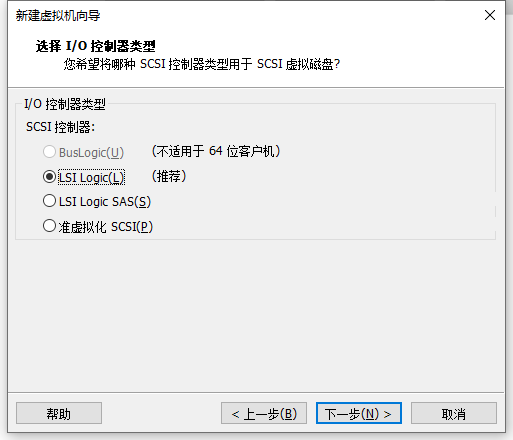

###### 10.  磁盘类型

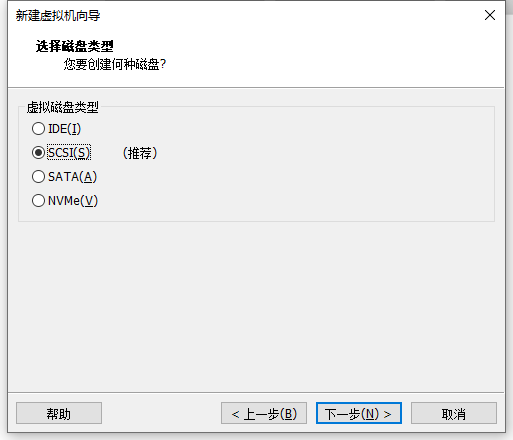

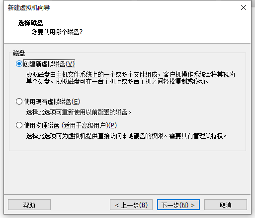

###### 11. 磁盘容量

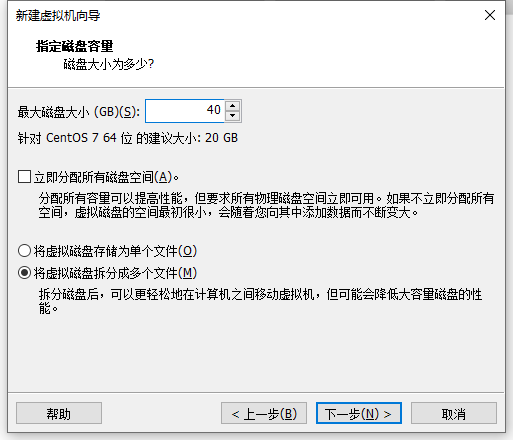

###### 12. 磁盘文件命名

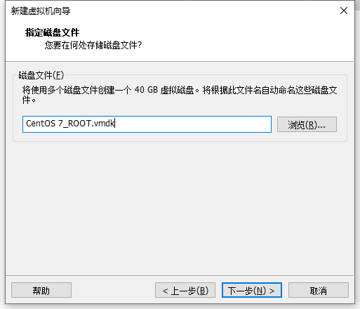

###### 13. 最后一步

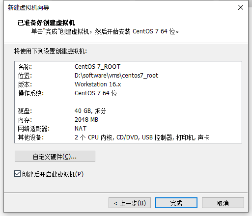

###### 14. 点击完成