##### 安装CentOS 7

1. **因为我在创建虚拟机的时候就选择看对应的镜像，所以这里直接选安装 CentOS 7**
   
    **PS:镜像位置（阿里云盘：CentOS-7-x86_64-Minimal-1908.iso）**

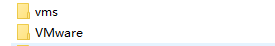

###### **这里我们直接安装英文版本**

**设置对应的配置**

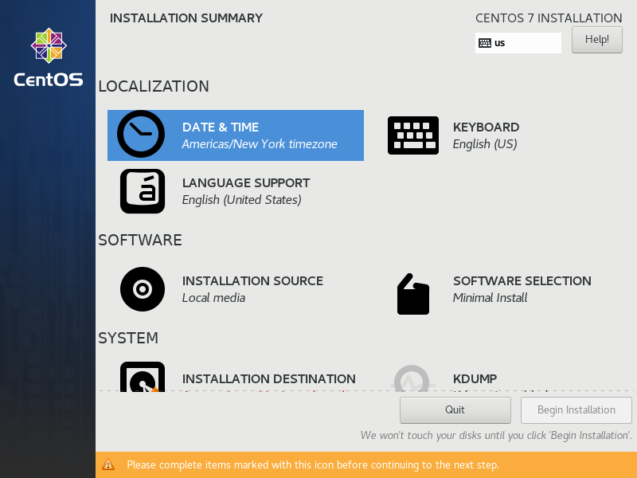

###### 设置时区（选择东八时区）

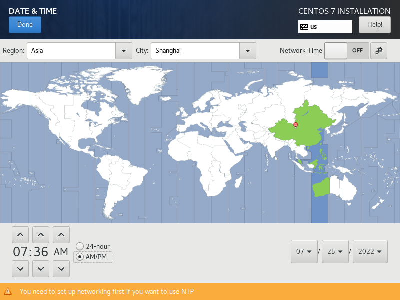

​									添加输入法

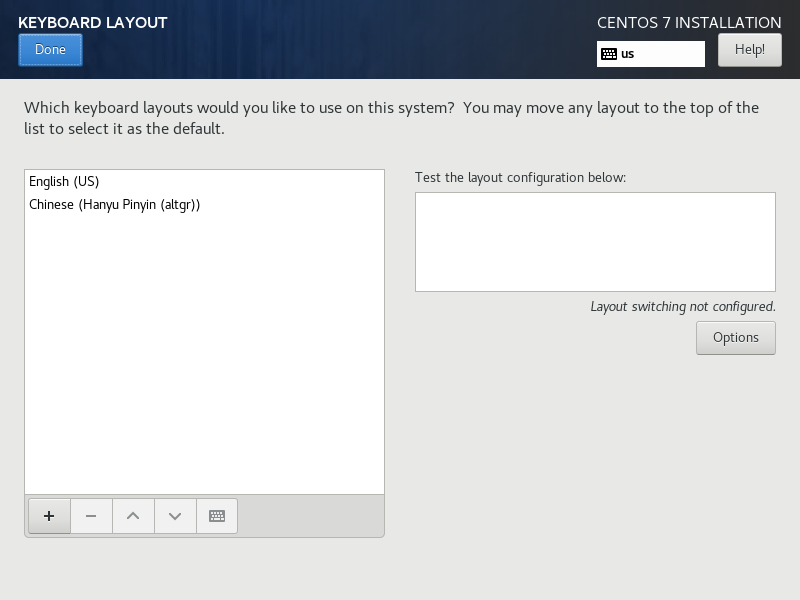

###### 语言为英文

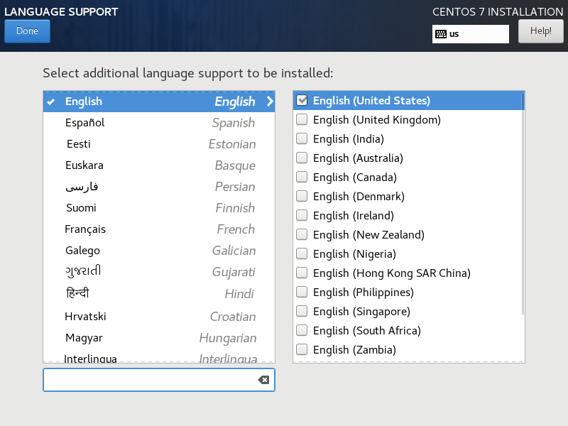

###### 因为我们选择的安装包是Minimal，所以这里只有最基本的功能，若是需要其他的功能（桌面、网络工具等），可以选择功能更多的安装包

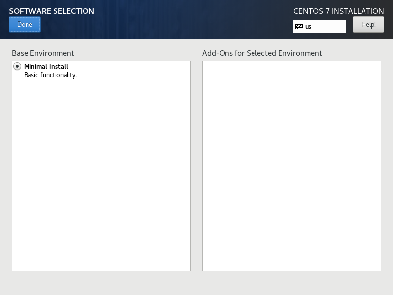

###### 这里我们可以自动配置引导分区、交换分区，也可以默认分配，这边我们选择默认分配

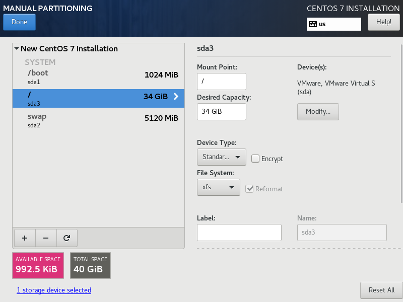

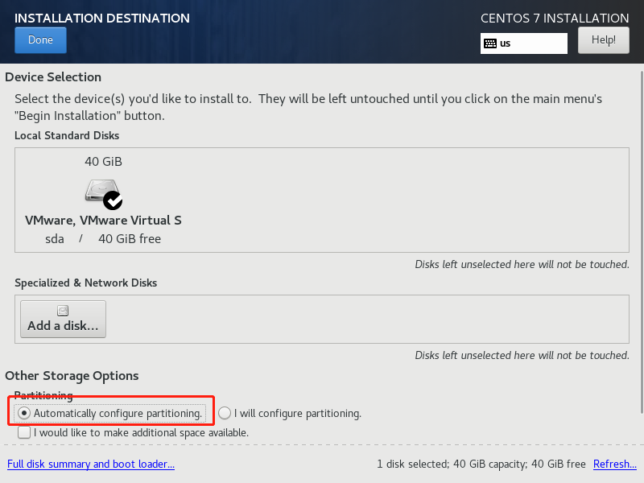

###### 这里可以修改 Host name和把连接外网的开关打开

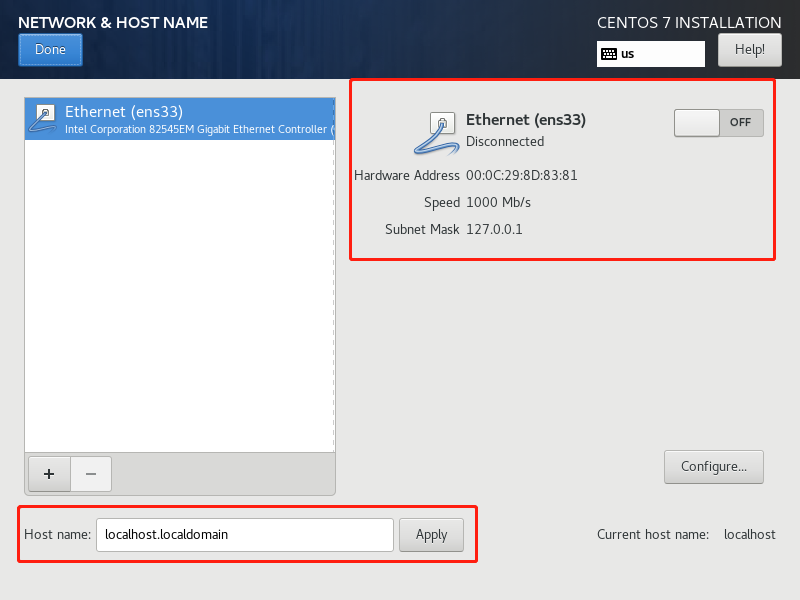

###### 点击开始安装，一路yes就行

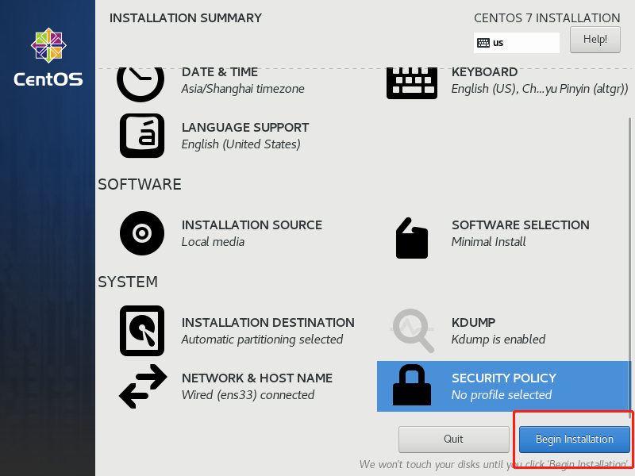

###### ps 这里可以配置root用户密码，和创建新用户的密码

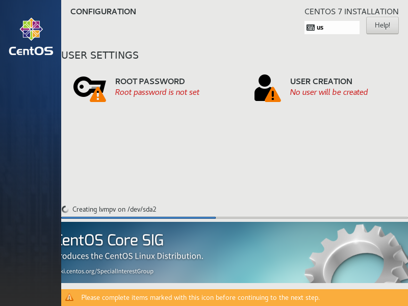