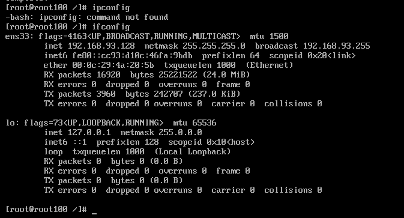
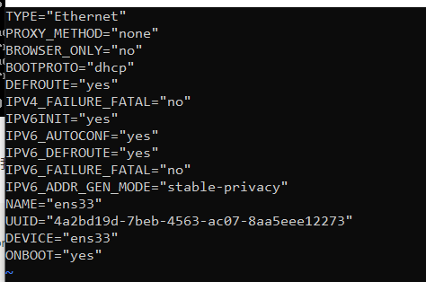
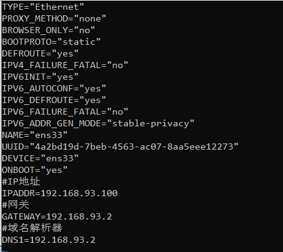
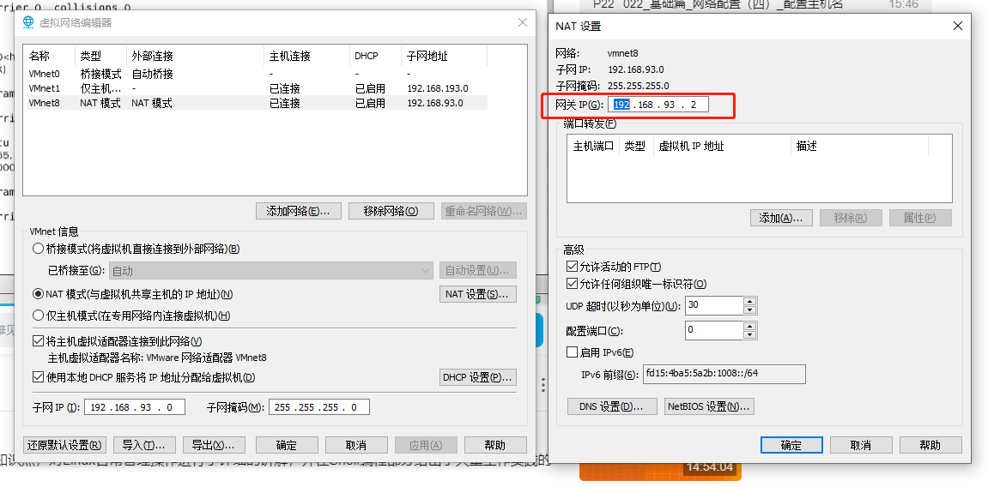
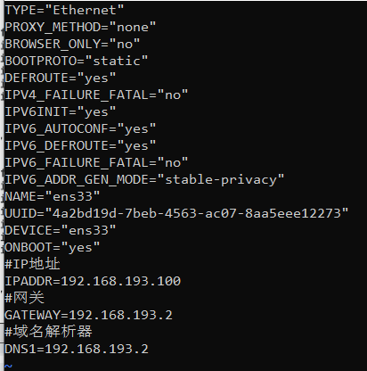
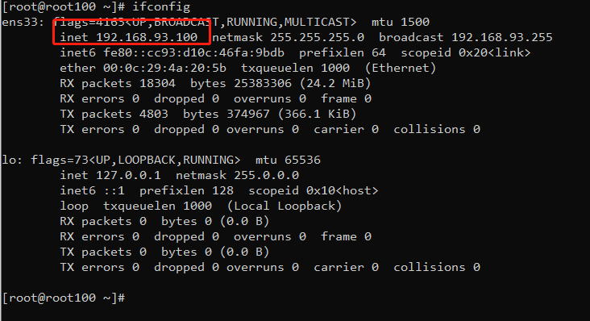
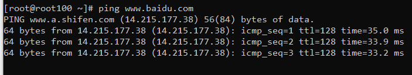
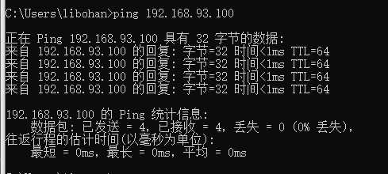
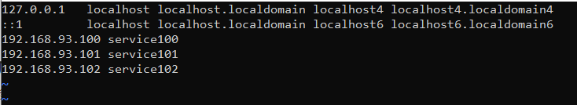

##### 修改静态IP 配置主机名称

由于linux安装包是Minimal最小安装包模式，导致 ifconfig命令无法执行，所以我们先安装网络工具

```bash
yum install upgrade
yum install net-tools
```

安装完成后再次数据 icconfig



2 . 因为DHCP服务我们每次开机重新进入IP都会变化，会让我们连接和访问比较麻烦，所以我们直接配置他的静态IP

```bash
vi /etc/sysconfig/network-scripts/ifcfg-ens33
```



可以看到当前启动的协议是dhcp（动态分配IP），修改为 static



配 IP地址、网关、域名解析器（这里的网关需要能够对应上）



```bash
#IP地址
IPADDR=192.168.93.100
#子网掩码
NETMASK=255.255.255.0
#网关
GATEWAY=192.168.93.2
#域名解析器
DNS1=192.168.93.2

ps:若是克隆的虚拟机则只需要需要改IPADDR即可
```



修改完成后 重启服务

```bash
service network restart

# 或者
systemctl stop network
systemctl restart network
```


查看是否修改成功，以及能否连接上网络

```bash
ifconfig
ip addr
```







更改完成

##### 修改主机名称

这种方式修改此文件需要重启

```bash
vi /etc/hostname

```

这种方式可以直接修改（实时生效）

```bash
hostnamectl set-hostname service100
```

验证


配置映射 host

```bash
vi /etc/hosts
```

