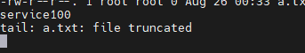
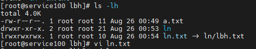

# 文件目录类

##### 1. 显示当前工作目录的绝对路径

```bash
pwd
```

##### 2. 列举出当前文件夹下面所有的类容

```bash
ls -a    --all
ls -tlr
ls -l    use a long listing format
```

##### 3. 创建文件夹

```bash
mkdir dir
mkdir b c #创建b和c两个文件夹
mkdir -p /home/cib/dir #若是父类没有对应的文件夹创建对应的文件夹
```

##### 4. 删除文件夹

```bash
rmdir dir
rmdir b c #删除b和c两个文件夹
rmdir -p /home/cib/dir #删除文件夹，若是父文件夹为空继续删除
```

##### 5. 创建文件

```bash
# touch
touch /home/cib/file
# vi
vi /home/cib/file #记得wq保存，不然不会保存
```

##### 6. 复制文件

```bash
cp /home/cib/file /home/cib/file2
#若是存在文件会提示覆盖
\cp /home/cib/file /home/cib/file2
#原生命令不会覆盖
```

##### 7. 复制文件夹

```bash
cp /home/cib /home
cp -r /home/cib /home #递归删除
```

##### 8. 删除

```bash
rm file #删除文件
rmdir /home/cib #删除文件夹
rm -r /home/cib #递归删除，交互式
rm -rf /home/cib #递归删除
```

##### 9. 移动

```bash
mv /home/cib/file1 /home/cib/cib #移动并且重命名
```

##### 10. 查看文件内容

```bash
# 1. cat
cat fileNmae

# 2. more
more fileName
# GG 
# gg 
# b 
# f 
# = 
#:f

# 3. less 功能更强大，类似于vi
less fileName

# 4. vi
vi fileName
# GG 跳转到文本末页
# / 搜索
# ? 搜索
# gg 跳转到文本首页
# n 配合 “/”
# N
# :%d 删除全部

# 5. 输出内容到控制台（文件）
echo "hello world"
echo -e "hello \nworld" 
#-e 支持反斜杠控制的字符转换

echo $PATH
# 输出环境变量到控制台

echo -e "hello \nworld" > a.txt
ll > a.txt
# 输出重定向 （覆盖写入）
echo -e "hello \nworld" >> a.txt
# 输出重定向 （追加写入）

# 6. 输出文件头部内容
head -n 20 filename
#  lines

# 7. 输出文件尾部内容
tail -500f filename
# follow 
ctrl s    #暂停输出
ctrl q    #继续输出
ctrl c    #推出输出
#PS：若是直接 复写会报错
ls -i     #查看文件inode节点
```


 file truncated



echo > 相当于删除了之前的文件，有创建另一个新的文件。而之前监控的文件不存在就报错了

##### 11. 软链接（Link）和硬链接

```bash
# 为一个文件或目录创建软连接（可以链接一个文件或者目录）
ln -s [原文件或目录]  [软连接名]
ln -s /root/a.txt /root/ln/b.txt
ln -s /root/ln /home/l

#硬链接
ln [原文件或目录]  [软连接名]

#如何查看创建的文件是如软连接和链接的文件位置
ls  -lh
pwd
pwd -P
cd -P [软连接的位置]

#删除软连接
rm -rf [软连接名称]
注意：删除软连接是删除的是对应的文件，若是加上/ 会删除对应的原文件
```



##### 12. history

```bash
history    #查看所有历史执行的命令
history 10 #查看10行命令
! 112      #重复执行112行命令
history -c #清除历史命令
```