# 磁盘管理类

## 1.du 查看文件和目录占用的磁盘空间

```bash
du 文件/目录

yum install tree
tree
#
-h    #--human-readable
-a    #--all 不仅查看子目录，还包括文件大小
-c    #total 总量（所有行）
-s    #summarize 总和（一行）
--max-depth    #最大深度
du -h --max-depth=1
```

## 2.df 查看磁盘空间使用情况（disk free）

```bash
df [选项]
-h    #--human-readable

df -h
Filesystem                       Size  Used Avail Use% Mounted on
#基于内存的文件管理系统（swap）
devtmpfs                         898M     0  898M   0% /dev
#共享内存 shared memory 默认内存一半
tmpfs                            910M     0  910M   0% /dev/shm
tmpfs                            910M  9.6M  901M   2% /run
tmpfs                            910M     0  910M   0% /sys/fs/cgroup
/dev/mapper/centos_root100-root   37G  1.3G   36G   4% /
/dev/sda1                       1014M  149M  866M  15% /boot
tmpfs                            182M     0  182M   0% /run/user/0
```

## 3.free 查看当前内存的使用情况

```bash
free -h
```

### 3.1lsblk 查看设备挂载情况

```bash
[root@service100 /]# lsblk 

NAME                    MAJ:MIN RM  SIZE RO TYPE MOUNTPOINT
#a 第一块硬盘
sda                       8:0    0   40G  0 disk
├─sda1                    8:1    0    1G  0 part /boot # 第一个分区
└─sda2                    8:2    0   39G  0 part
  ├─centos_root100-root 253:0    0   37G  0 lvm  /
  └─centos_root100-swap 253:1    0    2G  0 lvm  [SWAP]
sr0                      11:0    1  942M  0 rom

[root@service100 /]# ll /dev/ |grep sr0
lrwxrwxrwx. 1 root root           3 Aug 29 02:14 cdrom -> sr0
brw-rw----. 1 root cdrom    11,   0 Aug 29 02:14 sr0

[root@service100 /]# lsblk -f
NAME   FSTYPE   LABEL          UUID                                   MOUNTPOINT
sda
├─sda1 xfs                     c7226e4a-b41e-47c2-a8ad-4e0cc5aceb51   /boot
└─sda2 LVM2_mem                eiNHdu-gxjS-v754-wlwC-Hp1H-QOfy-m1bdNI
  ├─centos_root100-root
       xfs                     fcb6ed78-d22c-4e92-97e0-5d9eae046bb9   /
  └─centos_root100-swap
       swap                    d9b32426-81cb-4d3d-ae4d-9e548a4a474e   [SWAP]
sr0    iso9660  CentOS 7 x86_64
                               2019-09-11-19-02-53-00
```

## 4.mount/umount 挂载/卸载

```bash
mount [-t vfstype] [-o options] device dir
unount 

#eg
[root@service100 mnt]# mount /dev/cdrom /mnt/cdrom/
mount: /dev/sr0 is write-protected, mounting read-only
[root@service100 mnt]# lsblk
NAME                    MAJ:MIN RM  SIZE RO TYPE MOUNTPOINT
sda                       8:0    0   40G  0 disk
├─sda1                    8:1    0    1G  0 part /boot
└─sda2                    8:2    0   39G  0 part
  ├─centos_root100-root 253:0    0   37G  0 lvm  /
  └─centos_root100-swap 253:1    0    2G  0 lvm  [SWAP]
sr0                      11:0    1  942M  0 rom  /mnt/cdrom

[root@service100 cdrom]# umount /mnt/cdrom
[root@service100 cdrom]# lsblk
NAME                    MAJ:MIN RM  SIZE RO TYPE MOUNTPOINT
sda                       8:0    0   40G  0 disk
├─sda1                    8:1    0    1G  0 part /boot
└─sda2                    8:2    0   39G  0 part
  ├─centos_root100-root 253:0    0   37G  0 lvm  /
  └─centos_root100-swap 253:1    0    2G  0 lvm  [SWAP]
sr0                      11:0    1  942M  0 rom

# 写入配置文件下次开机自动挂载
[root@service100 cdrom]# vi /etc/fstab
```

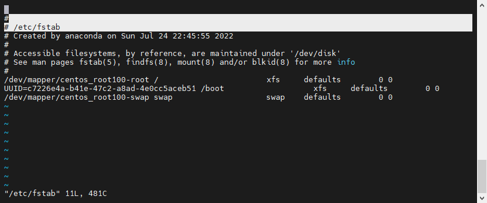

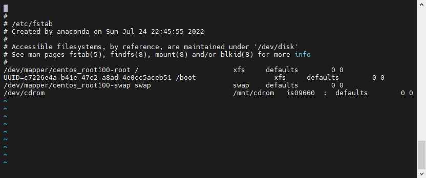

### 4.1fdisk 分区

```bash
fdisk -l    #查看磁盘分区详情
fdisk 硬盘设备名    #对新增硬盘进行分区操作

#fdisk 必须在root才能操作
```

### 4.2添加硬盘

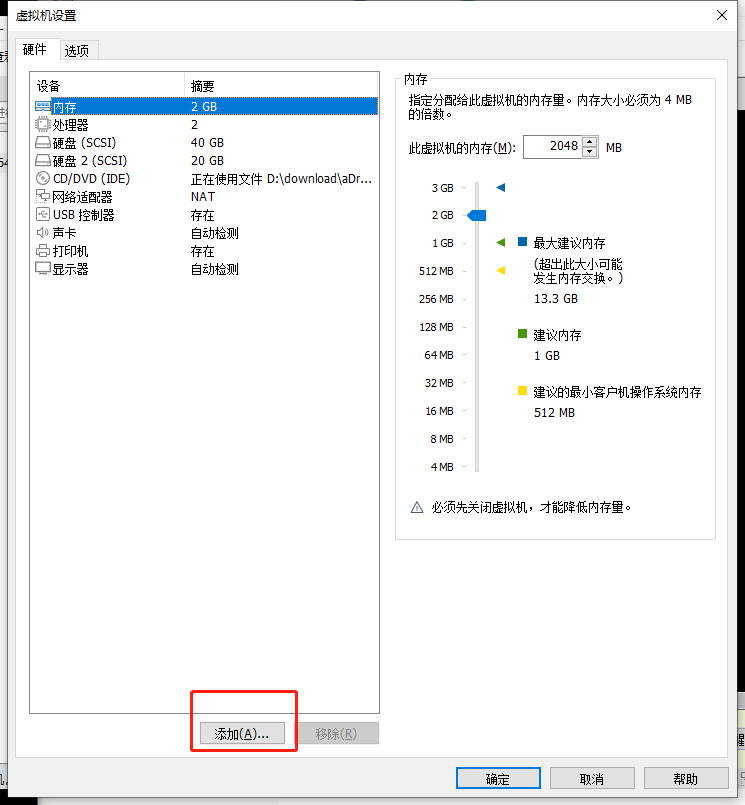

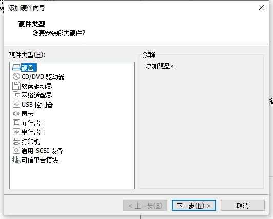

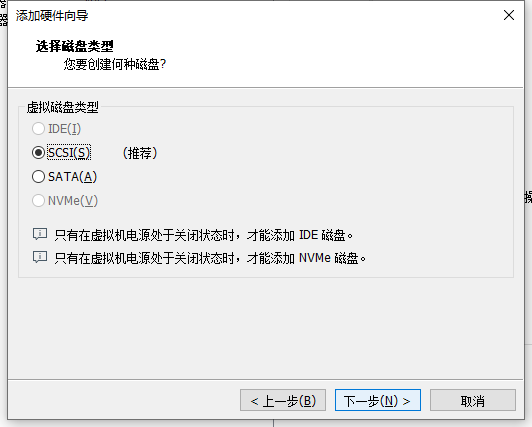

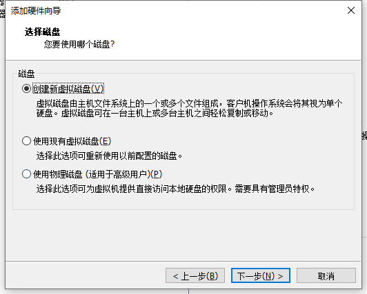

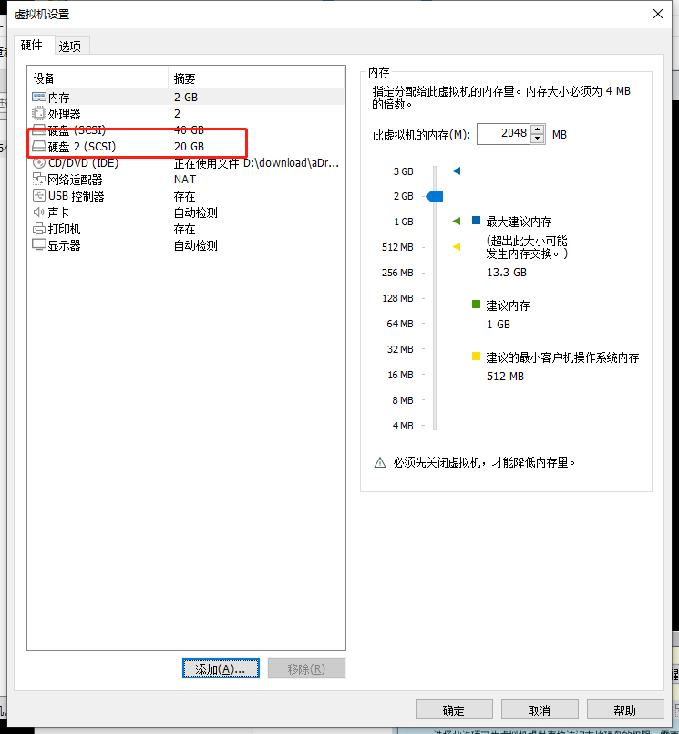

PS：添加完硬盘必须重启

```bash
fdisk sdb
```

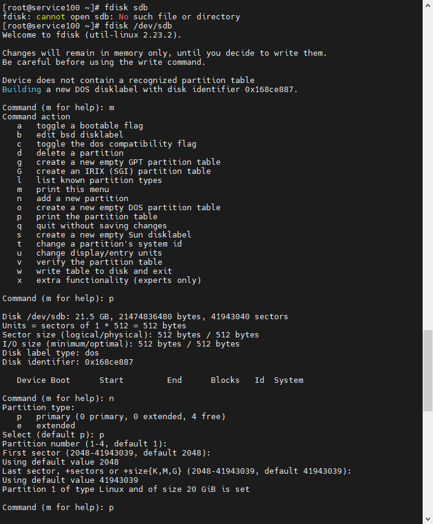

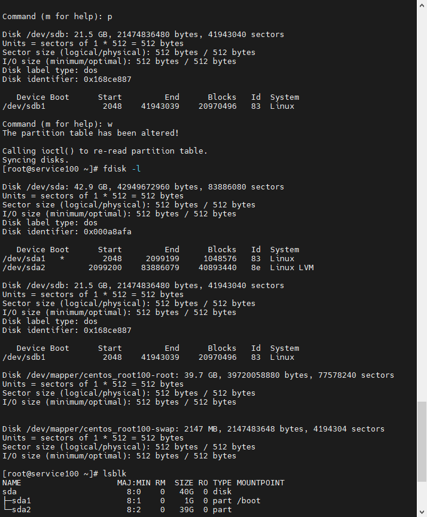

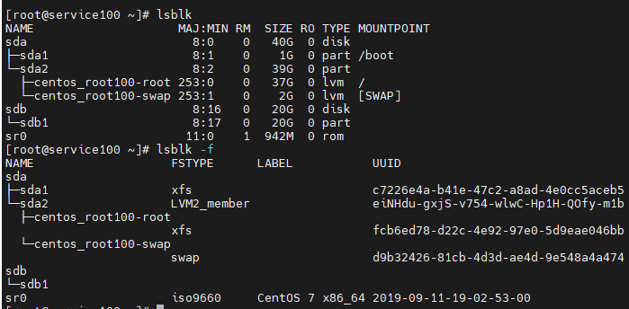

此时并无创建文件系统

```bash
mkfs -t xfs /dev/sdb1
```

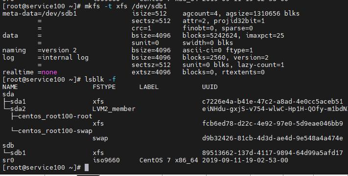

### 4.3挂载

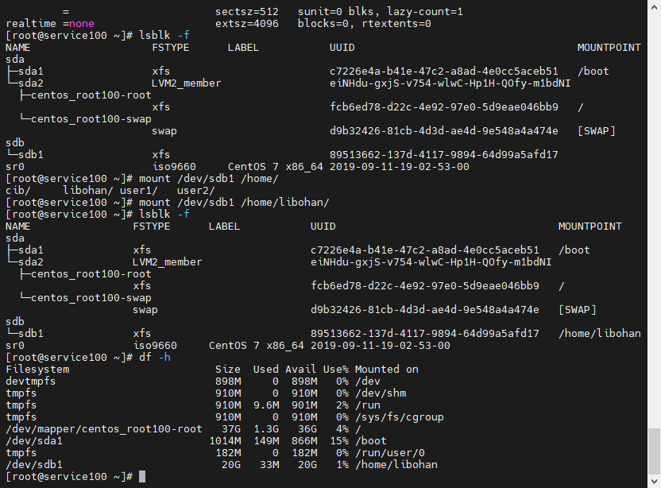